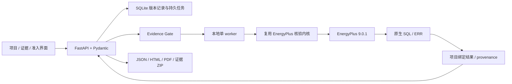

# 稀土智暖 VRA-Trust

既有公共建筑可核验节能改造决策智能体。核心原则：可复核、可拒答、可补证、可重放。

当前已在 Phase 0/1 基础上接入节点追溯、碳因子选择性重算、受控工具执行与 DeepSeek Adapter、有限域真实仿真搜索，以及人工确认到简单三维的闭环。**这仍不是全部模块或生产环境验收完成。** 详见 docs/TRUST_AGENT_SPATIAL_DELIVERY.md。

## 启动

最新增量：真实账号与项目隔离，以及项目侧栏、中央任务区、独立工作视图和右侧详情。见 docs/ACCOUNT_WORKSPACE_UPDATE.md。

需要 Python 3.12、Node 22+ 和 EnergyPlus 9.0.1。

```powershell
python -m venv .venv
.venv/Scripts/python -m pip install -r backend/requirements-dev.txt
cd frontend
npm ci
npm run build
cd ..
$env:ENERGYPLUS_EXE = 'F:/EnergyPlusV9-0-1/energyplus.exe'
./Start.ps1
```

访问 http://127.0.0.1:8766 。本机任务也支持已有的 ../.codex_work/vra-venv 开发环境。Start.ps1 仅监听本机，不自动安装依赖。

首次访问自行创建账号（用户名 3–32 位，密码至少 10 个字符）。无默认密码；既有项目归入首个账号，其他账号只能访问自己的项目。账号数据库保存在 runtime，不得提交或公开。当前暂无邮件找回。

1. 创建项目并填写建筑声明，或显式导入官方参考模型。
2. 上传 IDF/EPW 和其他资料，登记出处、定位、授权、登记人；PDF/图片当前不自动 OCR。
3. 人工核对并确认模型/天气；输入不唯一、未确认或文件损坏时 Gate 拒绝计算。
4. 运行 baseline/R1/R2，查看真实任务状态、能耗、EUI、运行 CO2、Warnings 和 SQL 定位。
5. 查看依据，下载 JSON/HTML/PDF/原始证据 ZIP。证据变更使受影响结果失效，确定推荐保持拒答。

参考模型不是实际南昌建筑。基准已有保温，追加保温参数是教学假设；碳情景不是正式地区核算或 CCER。

## 验证

```powershell
.venv/Scripts/python scripts/verify.py --engine
.venv/Scripts/python scripts/replay.py runtime/runs/run_<实际ID>
```

verify --engine 创建新的真实运行；日志在 validation/final，API 验收在 validation/phase1。最后会故意撤回基准证据确认，以验证 stale 拒答。失败和旧记录保留。
不带 --engine 时只跑代码检查/测试/构建；若本地已有旧原生运行且代码变更，原生版本检查可能要求重新运行参考算例。

## 架构



物理能耗不由 LLM 产生。结构化声明目前核对 IDF，尚不负责自动生成模型。节点图区分证据版本、仿真、能耗、面积、EUI、因子和碳排；改变因子仅重算碳排，原仿真保持不变。

## 资料导航

- docs/CURRENT_STATE_AUDIT.md：修改前真实状态及原包依据。
- docs/IMPLEMENTATION_STATUS.md：当前完成度、阻塞和下一步。
- docs/ROUND1_DELIVERY.md：本轮架构、变更、验收、未实现项。
- docs/API_CONTRACT.md / shared/schemas：契约及 OpenAPI。
- docs/REPLAY.md：可复算边界。
- docs/OPEN_MODELS.md：公开模型来源及许可。
- docs/DEPLOYMENT.md：本地 / Docker / 阿里云阶段边界。
- docs/PHASE_BACKLOG.md：拟同步 GitHub 的分阶段 Issues。
- AGENTS.md / .agents/skills/vra-trust：后续开发上下文。

## 保留与隔离

frontend/legacy 保存原 Three.js/图表/适配/报告源码。fixtures/demo 保存历史 JSON 与官方参考输入，活动前端不读取历史结果。
legacy/backend_submission 和 research/original_guo 在本机保留，因原始交付/研究资料未经公开整理，不纳入 Git。原始压缩包与上一版目录均未修改。
runtime、runs、validation、密钥、依赖和私人建筑资料不提交。

## 发布状态

本地会话和项目授权已验证；团队共享、邮件找回和公网部署未完成。HTTPS 部署必须设置 VRA_COOKIE_SECURE=true，另行配置域名/TLS/代理。Docker Compose 为准备配置，未运行容器；阿里云和第二台电脑验收按用户最新指示暂缓。GitHub app 写入返回 403 时，本地 Git/CI 文件已就绪不等于已远程发布。


## 新增入口

- 首页嵌入八步工作流动画，可暂停和逐步切换，明确标记为流程示意。
- 首个管理员账号：侧栏 **开发者设置** → 填写 DeepSeek Key / 模型 → 保存 → 测试连接。Key 不进入前端构建或浏览器存储。
- 项目工作台：选择“本地工程流程”或“AI Provider”，观察真实工具与 Provider 请求时间线；工程结果仍来自工具。
- 仿真页：修改碳因子 → 观察 Carbon STALE → 仅重算碳排。
- 反例与补证：填写共同材料导热系数离散点、来源与预算 → 真实仿真 → 条件补证成本候选排序。
- 图纸与三维：先导入/确认来源，再填写墙体坐标、尺寸、状态和人工依据；生成确定性几何，点击墙查看证据。

运行专项真实验收：`python scripts/verify_trust_slice.py`。它在 validation 下建立隔离账户，运行 3 个参考方案和 3 次预算内反例仿真，并核验选择性重算不调用 EnergyPlus。

Provider 协议依据：[DeepSeek 官方 Tool Calls 文档](https://api-docs.deepseek.com/guides/tool_calls/)。默认模型 deepseek-flash，可在管理员设置中修改。未填 Key 时不会模拟 LLM 成功；协议测试不等于付费服务商在线验收。
