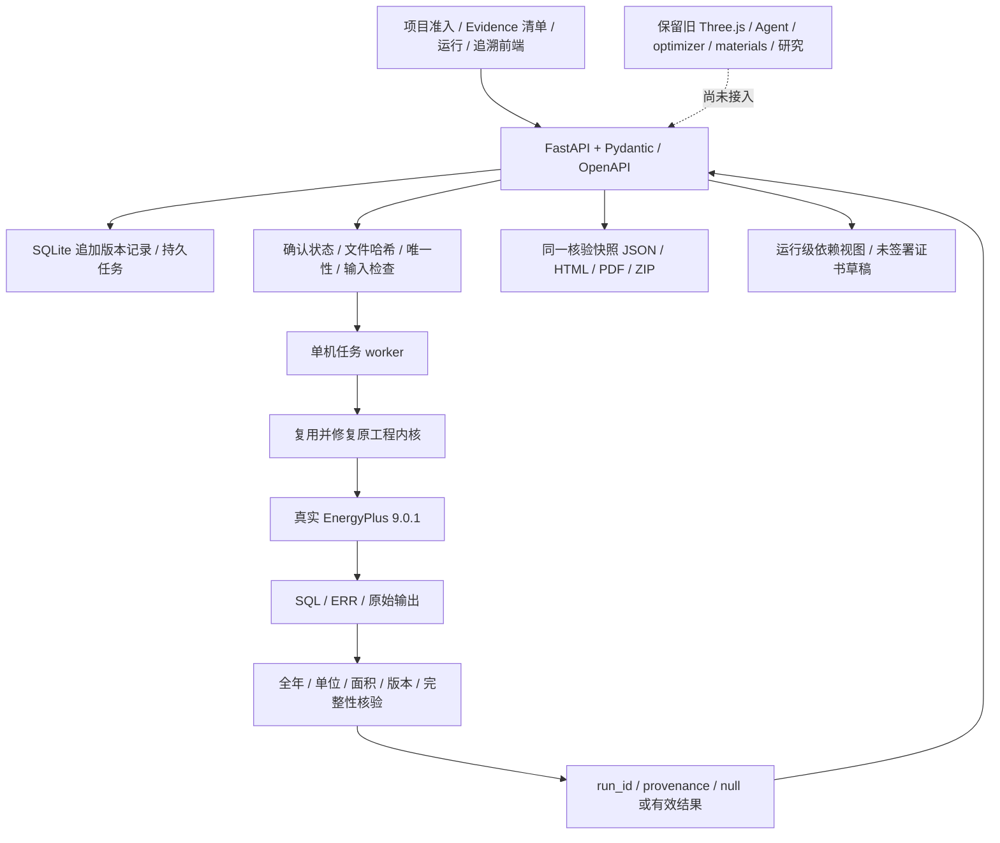

# 第一轮交付 · VRA-Trust · 2026-09-23

本轮交付可运行的 Phase 0/1 本地参考算例纵向流程。不是全部模块合并完成，不是真实建筑节能成绩，也不是已部署产品。

## A. 当前真实架构

## B. 分模块完成度

|模块|状态|已核验范围与缺口|
|---|---|---|
|Frontend|PARTIAL|项目、资料、人工确认、准入、真实任务、三方案、依据及报告；原 3D 尚未集成进新工作区|
|Backend|PARTIAL|正式 API、schema、SQLite、队列、上传与失败处理；无公网认证/租户隔离|
|Agent|LEGACY / MISSING|旧原型保留；真正 Tool Calling、LLM Gateway 尚未实现|
|EnergyPlus|DONE（参考链）|真实 9.0.1 + SQL 全年/单位/面积验证；不是实际项目校准|
|Evidence|PARTIAL|清单、文件、定位、哈希、复核、版本、准入已贯通；OCR/语义抽取/传感器接入未实现|
|Claim DAG|PARTIAL|运行级输入→仿真→指标→决策视图、失效；无通用 DAG 引擎及节点级选择性重算|
|Decision|PARTIAL|可比性检查和确定推荐拒答、证书草稿；反例/稳定性证明/成本价值排序未实现|
|Drawing|MISSING|可登记图纸证据；无墙体识别、缺口检测或候选补全|
|3D|LEGACY / REUSABLE|原 Three.js 与示意几何完整保留；未转成 Building Schema 驱动的空间证据界面|
|GitHub|BLOCKED（远程）|本地 Git、分支、CI、Issue 清单已建立；集成写入 403，未推送/PR/远程 CI|
|Cloud|BLOCKED|Compose 与部署说明已准备；仅配置解析通过，阿里云和容器运行未验收|

## C. 本轮实际修改文件

- 复用并修改 backend/core.py：支持锁定项目输入与快照根，强化 run/case/scheme 与哈希绑定；保留原生 SQL/真实引擎。
- 新增 backend/api.py、schema.py、store.py、domain.py、reports.py：正式契约、项目证据任务、核验和报告。
- 重建 frontend/src 的项目工作区；旧 src/tests/index 保留到 frontend/legacy，历史静态 JSON 移至 fixtures/demo。
- 新增 tests/test_api.py、test_parser_contract.py、前端契约测试及 scripts/golden_path.py、verify.py、replay.py。
- 新增 AGENTS.md、.agents/skills/vra-trust 及五份 references、shared/schemas、CI、deployment、docs。
- 更新案例路径、参考准备脚本和 Start.ps1。完整逐文件差异在 CHANGED_FILES.txt，模块复用/归档理由在 FILE_DISPOSITION.md。

## D. 新增的实际能力

创建项目并登记建筑声明；文件上传及 Evidence Manifest；人工确认与复核版本历史；Evidence Gate；可持久化真实仿真；输入与计算版本绑定；三方案同条件比较；运行级来源追溯；失效后显示空值；共享核验快照的 JSON/HTML/PDF；原始证据下载；单独目录重放计算。

结构化声明目前用于登记与核对，不自动生成 IDF。上传图纸不是识别图纸。证书为草稿且明确未签署、稳定性未评估。旧模型、历史数据和研究资料保留在本机，未提交私有原始资料。

## E. 真实测试结果

执行入口：`python scripts/verify.py --engine`。完整日志：本机 `validation/final`。

|检查|结果|
|---|---|
|后端 pytest|61 passed + 6 subtests；1 条 Starlette/httpx 弃用警告|
|前端 node test|11 passed（含保留的 6 项适配回归）|
|API 真实 Golden Path|33 项检查通过；每个新 run 实际调用 EnergyPlus|
|Lint / build / schema export|后端 Ruff、前端语法检查、Vite 构建、契约导出通过|
|原生 SQL parser contract|真实 SQL 的测试投影，7 项正/负测试；测试夹具不提供生产结果|
|浏览器|创建空项目、参考资料确认、三方案真实提交、比较、失效空值和依据视图已操作验证|
|报告|JSON/HTML/PDF 同快照一致性测试通过；4 页中文 PDF 渲染核对|
|重放|R1 独立重跑成功，能耗差小于 0.01 kWh|
|部署|Compose 配置解析通过；未运行容器/云端/第二台电脑|

最终 API 验收运行：

|方案|run_id|年场地能耗 kWh|
|---|---|---:|
|baseline|run_c4ff1295e812472987c93c1cbe498124|57193.23|
|R1|run_5b1f7b60ed9e4ff380c337150a63e57c|55715.19|
|R2|run_975240d4b8cc4512a29e266ca86aada2|55592.10|

验收末尾故意撤回 baseline 证据确认，验证 baseline→STALE、数值→null、比较拒绝、R1 仍有效。因此以上是当次计算记录，不代表 baseline 当前仍可用。

真实负例另外创建 100 m² 声明项目，EnergyPlus 模型 SQL 面积为 927.2 m²；即使引擎成功，项目结果必须 failed、metrics=null，原始输出完整保留。

重放运行 `run_aab904091ecd4f4087e81325bd9bc9a3` 与源 R1 使用相同代码哈希 `0f155e0a2cdab6e566574e972dd607c578e7764e8e056f56c8d81a0032ff2039`。这是计算复现，不是独立模型有效性证明。

官方参考模型来自 EnergyPlus 5ZoneAirCooled，Golden 天气、927.2 m²；基准已有保温，R1/R2 追加 80/100 mm 教学假设材料。三方案各 2 项设备定容 Warning，仍有未满足设定点时间与自动定容影响，不能推出实际工程最优或稀土材料优势。因子为教学场景，无 CCER 或可交易信用结论。来源与许可在 OPEN_MODELS.md。

## F. 尚未实现

通用 Claim DAG、碳节点选择性重算、正式 Decision 对象与签署、LLM Provider 与真正 Tool Calling、检索、真实仿真驱动优化/反例搜索、主动补证价值计算、OCR/图纸预测、IFC/epJSON 转换、参数化 3D/证据覆盖、真实建筑校准、生命周期评价、正式碳资格核验、IoT、经济场景持久化、完整研究对照实验、公网身份认证及商业部署。

当前后端整体代码哈希变化会保守地使结果失效；不能声称已经实现通用选择性重算。原始文件哈希也不等于电子签名或防恶意重签的审计体系。

## G. 阻塞项

1. GitHub 个人协作者权限已生效，但 OpenAI/Codex GitHub 集成写文件和 Issue 仍返回 403；本机无可用 Git 登录凭据。远程操作未完成。
2. 阿里云尚无服务器连接/域名配置，本机 Docker daemon 未运行。
3. 无获授权实际建筑资料、实测参数和现场核验；公开模型只能作为参考链验证。
4. 无 LLM Provider 配置；后续调用需真实凭据和使用范围，密钥仅进后端。

## H. 下一阶段最高价值五项

1. 节点级 Claim DAG + 选择性重算，以“只变碳因子不重跑 EnergyPlus”为首条验收。
2. 真正 Agent 工具执行与一个 Provider，回答依据/缺口/准入并保留工具时间线。
3. 有明确搜索域与预算的真实仿真反例搜索，再接成本敏感补证排序；不能把未发现翻转写成证明稳定。
4. 图纸人工确认→Building Schema→确定性简单几何→构件证据抽屉的最小闭环。
5. 实际建筑与第二台电脑验收；GitHub 写入、CI 和阿里云环境就绪后再完成受控部署。

任务拆解在 PHASE_BACKLOG.md。推进这些阶段时继续复用现有工程内核与归档模块，不以精简计算器替代完整系统。
