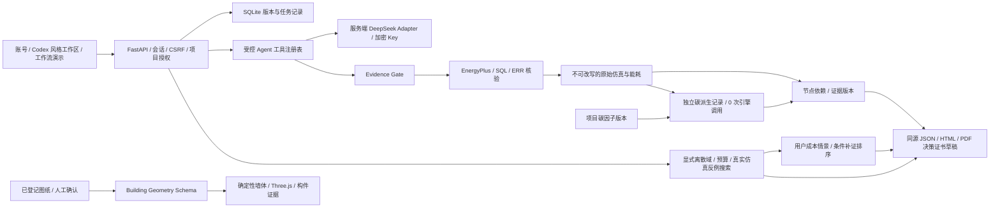

# Trust / Agent / Spatial 本轮交付

日期：2026-09-23。活动目录仍为独立的 vra-trust；没有替换或删除三人原包。

## 当前实际架构

## 完成度（限定范围）

|模块|本轮状态与边界|
|---|---|
|Frontend|已接通开发者设置、工具时间线、八步流程演示、因子变更/重算、节点有向连线、搜索与补证、图纸和三维页面；继续保留账号、证据、仿真和报告|
|Backend|受保护 API、参数契约、版本记录、异步任务和错误路径已测试；不等于公网安全验收|
|Agent|真实工具注册/执行和一个真实 HTTP Provider Adapter 已实现；协议与错误测试通过，尚无有效 Key 的联网验收；本地模式明确不冒充 LLM|
|EnergyPlus|官方参考三方案与搜索子仿真实际运行；不是南昌真实建筑或材料实测|
|Evidence|来源/定位/复核历史与图纸构件绑定可用；自动 OCR、账单解析与传感器接入未完成|
|Claim DAG|节点追溯、证据版本身份、因子影响传播、能耗/碳排序状态与选择性碳重算通过；不是覆盖全部未来算法的通用计算平台|
|Decision|同源未签署证书加入搜索域/预算/反例、独立碳版本和持久成本补证情景；仍不发布无依据的确定最优建议|
|Drawing|人工登记坐标和来源确认闭环；没有宣称自动补全真实图纸|
|3D|确定性墙体、楼层筛选、X-ray、点击构件证据；未与 IDF/BIM 构件绑定，affected_claims 为空，不虚构影响|
|GitHub|本地 feature 分支与 CI 文件继续建设；上轮连接器写入 403 未解除验收，未声称已推送/远程 CI|
|Cloud|用户最新要求暂缓；未连接阿里云、未部署、未完成第二台电脑验收|

## 真实验收

- 86 项后端测试 + 6 项 subtests；13 项前端测试；ruff、前端语法、Vite 构建、OpenAPI 导出通过。
- `python scripts/verify_trust_slice.py`：31 项检查通过。独立账号与数据库，3 次基础方案 + 3 次有限预算搜索，全部调用真实 EnergyPlus，原始证据保存在 validation/trust-slice。
- 参考年场地能耗：baseline 57193.23、R1 55715.19、R2 55592.10 kWh。原参考限定、定容 Warning、舒适性不足和教学因子边界继续成立。
- 将教学电力因子从 0.5 改为 0.7：原能耗/EUI不变；碳值置 null、节点 STALE、碳排序 STALE、证书 PARTIALLY_STALE；原始运行文件逐字节不变。
- 仅重算碳时，将物理运行入口设为“如果调用即测试失败”，操作仍成功；独立派生记录写入 energyplus_calls=0。
- 搜索共同 Material IN46，离散导热系数 [0.023, 0.035] W/(m·K)，3 次调用预算只覆盖 1/2 个网格点；结果 NO_FLIP_WITHIN_BUDGET。**没有实际发现翻转，不演示虚构反例。** 参数域是验收假设，不是材料实验范围。
- 无已观察翻转时，补证收益为 null。系统不把假设费用或条件排除率写成实测收益。
- 浏览器实际核验开发者配置入口、首页动画切步/暂停、真实本地工具时间线、合成图纸测试的简单三维、点击构件证据、楼层与 X-ray。合成图纸只存在隔离验收目录。
- 留存 1 项 Starlette/httpx 弃用提示，以及 Three.js 按需加载包超过 500 kB 的构建体积提示；均非测试失败。

验收摘要见 TRUST_AGENT_SPATIAL_ACCEPTANCE.json；完整日志在 validation/final。

## 修改文件

- 新增后端：backend/trust.py、gateway.py、agent.py、robustness.py、spatial.py、extensions.py。
- 后端集成：api.py、auth.py、core.py、domain.py、reports.py、requirements.txt。
- 新增前端：frontend/src/trust-ui.js、robustness-ui.js、spatial-ui.js；修改 main.js、layout.js、style.css。
- 测试：tests/conftest.py、tests/test_trust_agent_spatial.py、tests/test_api.py、scripts/verify_trust_slice.py。
- 契约与工程化：shared/schemas、scripts/export_contract.py、verify.py、check_frontend.mjs、.github/workflows/backend-ci.yml、.env.example、AGENTS.md、Repo Skill 引用和说明文档。

## 使用方法

1. 打开 http://127.0.0.1:8766 ，登录已有账号。刷新后可看到新增视图。
2. 首个管理员账号进入侧栏“开发者设置”，填入 Key、启用 Provider、保存并测试连接；项目工作台切换到“AI Provider”。密钥不应发送到聊天。Windows 使用 DPAPI 绑定当前系统账户，换电脑需重新配置；Linux 从进程环境注入。
3. “仿真”页修改项目碳因子，观察碳节点失效；点击“仅重算碳排”。物理代码版本改变造成的旧 run 失效仍需新仿真，不能通过重算碳绕过。
4. “反例与补证”页需要各方案最新运行有效、包含 baseline。填写有依据的离散参数域和预算。多个用户填报补证候选可加入排序，保存到证书。
5. “图纸与三维”页先选择已登记来源；对照原图填写坐标、层数、厚度与定位。CONFIRMED 指人工确认，来源 ASSUMED 仍保留假设性质；保存后点击墙体查看依据。

Provider 参数依据：[DeepSeek Tool Calls 官方文档](https://api-docs.deepseek.com/guides/tool_calls/)。协议 fixture 测试不等于外部服务商实时验收。

## 尚未完成与最高价值后续工作

1. 真实 Key 下的 Provider 联网、复杂工具编排与失败恢复验收；目前界面已提供入口。
2. 获授权真实建筑及实测数据的校准、舒适性/工程约束/成本复核；参考模型不能替代。
3. HVAC/Schedule 等更多受控不确定参数与真实多目标优化。当前限定导热系数离散域；补证价值为条件反例排除情景，并非完整概率 VOI。
4. OCR/墙体识别候选与人工校正，以及几何到 IDF 的真实映射。旧材料/优化/研究模块仍需逐项审查后集成，不算本轮全部接通。
5. 用户恢复环境任务后，第二台电脑复算、GitHub 写入与远程 CI、阿里云受控部署。
